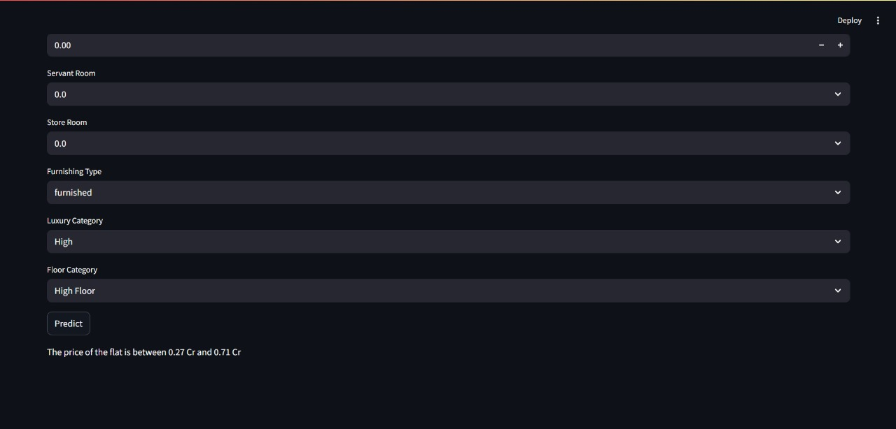
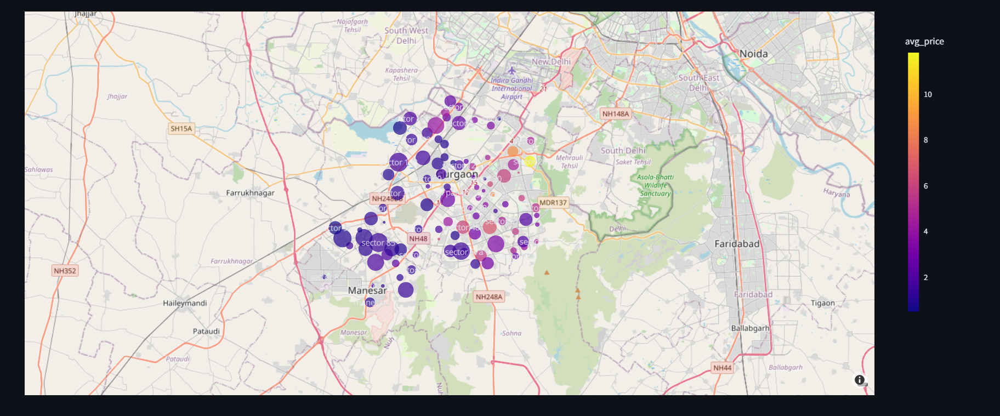

<div align="center">


Price Prediction

Visualization

</div>

# Real Estate Analytics Platform - Gurgaon Property Price Prediction

## Project Overview

This is a comprehensive **Data Science & Machine Learning Capstone Project** focused on analyzing and predicting real estate property prices in Gurgaon, India. The project encompasses data collection, exploratory data analysis (EDA), feature engineering, machine learning model development, and building a recommendation system for properties.

**Repository**: Real_Estate_Analytics_Platform  
**Owner**: Abhishek9124  
**Current Branch**: main

---

## Project Objectives

The main objectives of this project are:

1. **Price Prediction**: Build machine learning models to predict property prices in Gurgaon based on various features
2. **Market Analytics**: Provide spatial and statistical analysis of real estate properties
3. **Feature Insights**: Identify key factors influencing property prices
4. **Recommendation System**: Create a content-based recommendation system to suggest similar properties
5. **Deployment**: Deploy the analytics platform on AWS for real-world usage

---

## Project Architecture & Data Pipeline

### 1. Data Collection
- **Source**: 99acres.com (scraped data)
- **Property Types**: 
  - Flats/Apartments
  - Independent Houses
  - Residential Land
- **Data Files**:
  - `flats.csv` - Raw apartment data (~3000 records)
  - `houses.csv` - Raw independent house data
  - `appartments.csv` - Additional apartment data with detailed features (for recommendation system)

### 2. Data Integration
- **Notebook**: `merge-flats-and-house.ipynb`
- **Process**: Combines flats and house datasets into a unified dataset
- **Output**: `gurgaon_properties.csv`

### 3. Data Preprocessing
Multiple preprocessing steps for data cleaning:

#### 3.1 Flats Preprocessing
- **Notebook**: `data-preprocessing-flats.ipynb`
- **Operations**:
  - Remove irrelevant columns (link, property_id)
  - Rename columns for consistency (area → price_per_sqft)
  - Clean society names (remove ratings and special characters)
  - Standardize data formats
- **Output**: `flats_cleaned.csv`

#### 3.2 Houses Preprocessing
- **Notebook**: `data-preprocessing-houses.ipynb`
- **Similar operations** to flats preprocessing
- **Output**: `house_cleaned.csv`

#### 3.3 Level 2 Preprocessing
- **Notebook**: `data-preprocessing-level-2.ipynb`
- **Advanced cleaning and standardization**
- **Output**: `gurgaon_properties_cleaned_v1.csv` → `gurgaon_properties_cleaned_v2.csv`

### 4. Outlier Treatment
- **Notebook**: `outlier-treatment.ipynb`
- **Methods**: IQR-based outlier detection using boxplot analysis
- **Focus**: Remove extreme price outliers
- **Output**: `gurgaon_properties_outlier_treated.csv`

### 5. Missing Value Imputation
- **Notebook**: `missing-value-imputation.ipynb`
- **Techniques**:
  - Statistical imputation using ratios (e.g., super_built_up_area, carpet_area)
  - Forward and backward fill methods
  - Domain knowledge-based imputation
- **Output**: `gurgaon_properties_missing_value_imputation.csv`

---

## Exploratory Data Analysis (EDA)

### 5.1 Univariate Analysis
- **Notebook**: `eda-univariate-analysis.ipynb`
- **Analysis Includes**:
  - Distribution analysis for each feature
  - Skewness and Kurtosis calculations
  - Box plots for outlier identification
  - Bar charts for categorical variables
  - Observations on property types (75% flats, 25% houses)

### 5.2 Multivariate Analysis
- **Notebook**: `eda-multivariate-analysis.ipynb`
- **Relationships between**:
  - Price vs. built-up area
  - Price vs. number of bedrooms
  - Sector-wise price variations
  - Property type vs. price

### 5.3 Data Visualization
- **Notebook**: `data-visualization.ipynb`
- **Visualizations**:
  - Box plots for each sector showing price distribution
  - Scatter plots: Square footage vs. price
  - Pie charts: BHK distribution (1BHK, 2BHK, 3BHK)
  - Geographic/spatial analysis: Map visualization of sectors
  - Plotly interactive charts for exploration
  - Distribution plots and heatmaps

### 5.4 Pandas Profiling Report
- **Notebook**: `eda-pandas-profiling.ipynb`
- **Automated EDA**: Uses pandas-profiling for comprehensive statistical summaries
- **Output**: `output_report.html`

---

## Feature Engineering & Selection

### 6.1 Feature Engineering
- **Notebook**: `feature-engineering.ipynb`
- **Created Features**:
  - **Luxury Category**: Categorized from luxury score
    - Low: 0-50
    - Medium: 50-150
    - High: 150-175
  - **Floor Category**: Categorized from floor number
  - **Age-based Features**: Property age categories (new, old, under construction)
  - **Area Ratios**: Relationships between different area measurements
  - **Price per Square Foot**: Derived from total price and built-up area
  - **Amenity Features**: Extracted from facilities data
  - **Location Features**: Sector-based features and location advantages

### 6.2 Feature Selection
- **Notebook**: `feature-selection.ipynb`
- **Techniques**:
  - Correlation analysis for numerical features
  - Categorical feature importance
  - Redundant feature removal
  - Feature scaling and normalization
- **Output**: 
  - `gurgaon_properties_post_feature_selection.csv`
  - `gurgaon_properties_post_feature_selection_v2.csv`

### 6.3 Combined Feature Engineering & Selection
- **Notebook**: `feature-selection-and-feature-engineering.ipynb`
- **Integrated approach** combining both engineering and selection

---

## Machine Learning Models

### 7.1 Baseline Model
- **Notebook**: `baseline model.ipynb`
- **Approach**: Support Vector Regression (SVR) with RBF kernel
- **Preprocessing Pipeline**:
  - **Numerical Features**: StandardScaler
    - property_type, bedRoom, bathroom, built_up_area, servant room, store room
  - **Categorical Features**: OneHotEncoder
    - sector, balcony, agePossession, furnishing_type, luxury_category, floor_category
- **Validation**: 10-fold cross-validation (KFold)
- **Target Transformation**: log1p transformation for normalized distribution
- **Evaluation Metric**: R² score with Mean Absolute Error (MAE)

### 7.2 Model Selection
- **Notebook**: `model-selection.ipynb`
- **Capabilities**:
  - GPU support check (CUDA/PyTorch)
  - Multiple regression models comparison
  - Hyperparameter tuning
  - Cross-validation analysis
- **Features Handled**:
  - Ordinal encoding for furnishing types
  - Ordinal encoding for property types
  - One-hot encoding for sectors and age categories
  - StandardScaler for numerical features
- **Output Metrics**: Model comparison and performance analysis

---

## Insights Module

- **Notebook**: `insights-module.ipynb`
- **Purpose**: Generate actionable insights from the trained models
- **Analysis Includes**:
  - Feature importance ranking
  - Price variation patterns by sector
  - Impact of property characteristics on price
  - Recommendations for pricing strategy
  - Market trends and patterns

---

## Recommendation System

- **Notebook**: `recommender-system.ipynb`
- **Approach**: Content-Based Filtering using TF-IDF and Cosine Similarity
- **Features Used**:
  - Property facilities and amenities
  - Location advantages
  - Nearby locations
  - Price details
- **Methodology**:
  - Extract and parse facility information from property listings
  - Vectorize facilities using TF-IDF (unigrams and bigrams)
  - Calculate cosine similarity between properties
  - Recommend similar properties based on facilities match
- **Data Source**: `appartments.csv`
- **Use Case**: When a user clicks on a property, system recommends similar societies/properties

---

## Data Files & Outputs

### Input Data Files
| File | Description |
|------|-------------|
| `flats.csv` | Raw apartment data |
| `houses.csv` | Raw independent house data |
| `appartments.csv` | Apartments with detailed features |

### Intermediate Processing Files
| File | Stage | Description |
|------|-------|-------------|
| `flats_cleaned.csv` | After preprocessing | Cleaned apartment data |
| `house_cleaned.csv` | After preprocessing | Cleaned house data |
| `gurgaon_properties.csv` | After merge | Combined dataset |
| `gurgaon_properties_cleaned_v1.csv` | Level 1 cleaning | Initial combined cleaning |
| `gurgaon_properties_cleaned_v2.csv` | Level 2 cleaning | Further refined dataset |
| `gurgaon_properties_outlier_treated.csv` | Outlier removal | Outliers removed using IQR |
| `gurgaon_properties_missing_value_imputation.csv` | Missing value imputation | All missing values handled |

### Final Feature-Selected Files
| File | Description |
|------|-------------|
| `gurgaon_properties_post_feature_selection.csv` | First feature selection iteration |
| `gurgaon_properties_post_feature_selection_v2.csv` | Second feature selection iteration (final) |

### Analysis Outputs
| File | Purpose |
|------|---------|
| `output_report.html` | Pandas profiling automated EDA report |
| `area and areaWithType.txt` | Notes on area feature inconsistencies |
| `EDA univariate analysis.txt` | Summary of univariate analysis findings |
| `Project Overview.txt` | Project roadmap and initial planning |
| `feature_text.pkl` | Pickled feature data for model deployment |

---

## Project Roadmap & Status

### Completed Tasks ✓
- [x] Data gathering (3000+ flats from 99acres)
- [x] Data preprocessing and cleaning
- [x] Exploratory Data Analysis (EDA)
- [x] Outlier detection and treatment
- [x] Missing value imputation
- [x] Feature engineering
- [x] Feature selection
- [x] Baseline model development (SVR)
- [x] Model selection and comparison
- [x] Insights module
- [x] Recommendation system

### Planned Features
- [ ] Deploy on AWS
- [ ] Build Streamlit web interface
- [ ] Create analytics dashboard
- [ ] Implement spatial analysis map
- [ ] Add real-time price prediction API

---

## Technical Stack

### Languages & Libraries
- **Python 3.x**
- **Data Processing**: pandas, NumPy
- **Visualization**: Matplotlib, Seaborn, Plotly
- **Machine Learning**: scikit-learn, PyTorch
- **Feature Engineering**: sklearn pipelines and transformers
- **Analysis**: pandas-profiling
- **NLP/Recommendation**: scikit-learn TF-IDF, cosine similarity

### Tools & Platforms
- **Jupyter Notebooks** - Interactive development and analysis
- **Git** - Version control
- **AWS** - Planned deployment target
- **Streamlit** - Planned web framework
- **CUDA/GPU** - GPU acceleration support included

---

## Key Features of the Platform

### Analytics Module
- **Spatial Analysis**: Visualize properties on maps by sector
- **Price Distribution**: Box plots showing price variation by sector
- **Scatter Analysis**: Square footage vs. price correlations
- **Property Mix**: BHK distribution pie charts

### Machine Learning Module
- **Price Prediction**: Predict property prices using trained models
- **Price Range Estimation**: Provide price ranges for specific areas
- **Feature Impact Analysis**: Understand which factors influence prices

### Insights Module
- **Market Trends**: Identify price trends across sectors
- **Feature Analysis**: Price variation by property characteristics
- **Strategic Recommendations**: Pricing and investment recommendations

### Recommender System
- **Society Recommendations**: Click on a property to find similar ones
- **Facilities Matching**: Content-based filtering using amenities
- **Smart Suggestions**: Find comparable properties for informed decisions

---

## How to Use This Project

### 1. Running the Complete Pipeline
Execute notebooks in order:
```
1. merge-flats-and-house.ipynb
2. data-preprocessing-flats.ipynb
3. data-preprocessing-houses.ipynb
4. data-preprocessing-level-2.ipynb
5. outlier-treatment.ipynb
6. missing-value-imputation.ipynb
7. eda-univariate-analysis.ipynb
8. eda-multivariate-analysis.ipynb
9. data-visualization.ipynb
10. feature-engineering.ipynb
11. feature-selection.ipynb
12. baseline model.ipynb
13. model-selection.ipynb
14. insights-module.ipynb
15. recommender-system.ipynb
```

### 2. Quick Start - Run Specific Analysis
- **For EDA**: Run `eda-univariate-analysis.ipynb` and `data-visualization.ipynb`
- **For Predictions**: Run `baseline model.ipynb` and `model-selection.ipynb`
- **For Recommendations**: Run `recommender-system.ipynb`

### 3. Loading Pre-processed Data
Use the feature-selected datasets directly:
```python
import pandas as pd
df = pd.read_csv('gurgaon_properties_post_feature_selection_v2.csv')
```

---

## Key Findings & Insights

### Data Distribution
- **Property Types**: 75% flats, 25% independent houses
- **BHK Distribution**: Majority are 2BHK and 3BHK properties
- **Price Range**: Significant variation based on sector and amenities

### Feature Importance
Top factors influencing property prices:
1. **Built-up Area**: Strong positive correlation with price
2. **Sector/Location**: Major price variation factor
3. **Property Type**: Houses generally more expensive than flats
4. **Number of Bedrooms**: Positive correlation with price
5. **Age/Condition**: Property age affects valuation
6. **Luxury Category**: Premium amenities increase price

### Model Performance
- **Best Model**: Support Vector Regression (SVR) with RBF kernel
- **Evaluation**: 10-fold cross-validation for robust performance assessment
- **Metric**: Mean Absolute Error (MAE) for interpretable price prediction error

---

## Points for Improvement

As noted in the project documentation:
1. Enhance feature engineering with advanced techniques
2. Experiment with ensemble methods (Random Forest, Gradient Boosting)
3. Add more location-based features (proximity to metro, schools, hospitals)
4. Incorporate temporal features (market trends over time)
5. Improve data quality from source
6. Deploy interactive web dashboard
7. Implement real-time price prediction API
8. Add confidence intervals to price predictions

---

## File Structure Summary

```
dsmp-capstone-project-master/
├── Data Files
│   ├── Raw: flats.csv, houses.csv, appartments.csv
│   ├── Cleaned: flats_cleaned.csv, house_cleaned.csv
│   ├── Processed: gurgaon_properties*.csv
│   └── Feature Selected: gurgaon_properties_post_feature_selection*.csv
│
├── Jupyter Notebooks
│   ├── Data Prep: preprocessing, merge, outlier, missing value
│   ├── EDA: univariate, multivariate, visualization, profiling
│   ├── Feature Eng: engineering, selection, combined
│   ├── Modeling: baseline, model selection, insights
│   └── Recommendation: recommender system
│
├── Analysis Outputs
│   ├── output_report.html (Pandas Profiling)
│   └── .txt files (Notes and findings)
│
└── Model Assets
    └── feature_text.pkl (Pickled model/features)
```

---

## Conclusion

This Real Estate Analytics Platform provides a comprehensive solution for property price prediction in Gurgaon. Through rigorous data preprocessing, exploratory analysis, feature engineering, and machine learning, the project delivers actionable insights and predictions to stakeholders in the real estate market. The integrated recommendation system adds value by helping buyers find comparable properties.

**Future deployment on AWS will make this platform accessible as a web-based analytics and recommendation tool for real estate professionals and investors.**

---

## Contact & Author Information

**Project Owner**: Abhishek9124  
**Repository**: Real_Estate_Analytics_Platform  
**Branch**: main

---

*Last Updated: December 2024*
