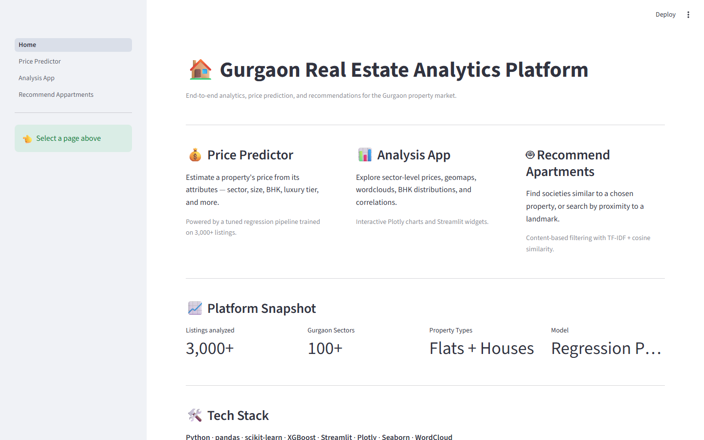
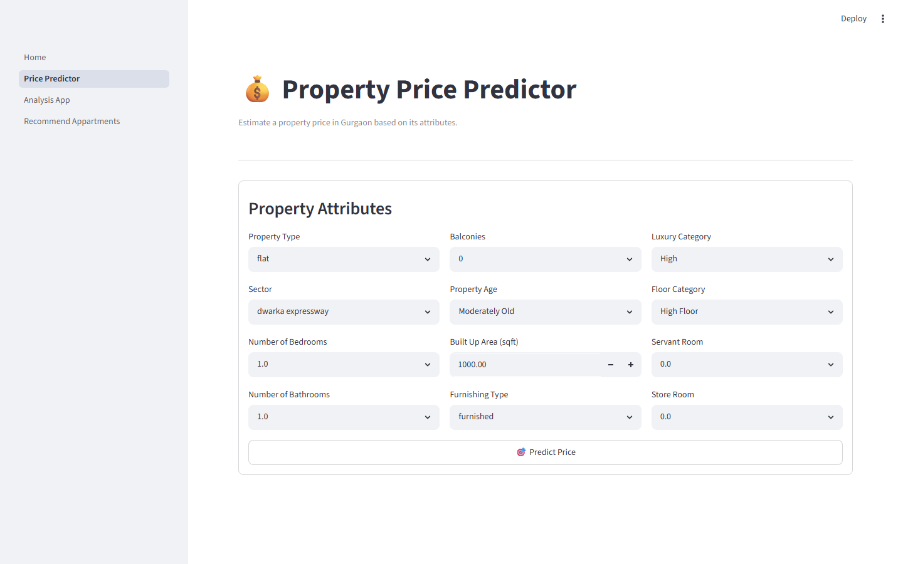
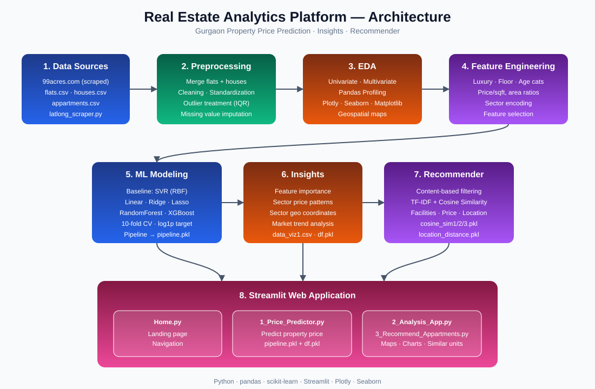

<div align="center">

# 🏠 Real Estate Analytics Platform
### *AI-Powered Property Price Prediction & Recommendation System for Gurgaon*


**An end-to-end Data Science capstone delivering price predictions, market analytics, and similarity-based property recommendations — built and deployed as an interactive web app.**

[🚀 Quick Start](#-quick-start) · [✨ Features](#-key-features) · [📊 Live Demo](#-live-ui-preview) · [🛠️ Tech Stack](#-tech-stack) · [📈 Results](#-results--impact)

</div>

---

## 🎯 Project Overview

> **Problem:** Gurgaon's real estate market is opaque — buyers struggle to gauge fair prices, and there's no easy way to find comparable properties.
>
> **Solution:** A unified analytics platform that **predicts prices**, **visualizes market trends**, and **recommends similar properties** — all from a single web interface.

This project demonstrates an **end-to-end data science workflow**: from raw web-scraped data to a deployed multi-page Streamlit application.

---

## 📊 Live UI Preview

<div align="center">


*Landing page — clean, modern interface with feature cards and at-a-glance metrics.*


*Price Predictor — input 12 property attributes and get a confidence-bounded price range in real time.*

</div>

---

## 🏗️ System Architecture

<div align="center">



</div>

**Pipeline at a glance:**
`Web Scraping → Data Cleaning → EDA → Feature Engineering → ML Modeling → Streamlit App`

---

## ✨ Key Features

### 💰 **Smart Price Predictor**
- Predicts property prices from **12 attributes** (sector, BHK, area, luxury tier, age, furnishing, floor category, etc.)
- Returns a **confidence-bounded price range** in ₹ Crores
- Backed by a scikit-learn `Pipeline` with one-hot encoding, scaling, and a tuned regression model

### 📈 **Interactive Analytics Dashboard**
- **🗺️ Geospatial heatmap** of price-per-sqft across Gurgaon sectors (Plotly Mapbox)
- **☁️ Wordcloud** of property facilities & amenities
- **📊 Scatter, box, KDE plots** for area-vs-price, BHK distributions, property-type comparisons
- **🔥 Correlation heatmaps** for feature relationships
- **💎 Luxury-score vs. price** scatter with property-type coloring

### 🤖 **Content-Based Recommender**
- Suggests **top-5 similar properties** for any chosen apartment
- Built on a **weighted ensemble of 3 cosine-similarity matrices**:
  - **Facilities** (TF-IDF on amenity text, uni + bigrams)
  - **Property specs** (one-hot encoded, standardized)
  - **Location proximity** (distances to landmarks)
- Also supports **radius-based search** ("show all properties within 5 km of Cyber Hub")

---

## 🚀 Quick Start

### Prerequisites
- Python 3.9+
- Git (with [Git LFS](https://git-lfs.com) for any large files)

### Setup & Run (Windows PowerShell)
```powershell
# 1. Clone
git clone https://github.com/Abhishek9124/Real_Estate_Analytics_Platform.git
cd Real_Estate_Analytics_Platform

# 2. Virtual environment
python -m venv venv
.\venv\Scripts\Activate.ps1

# 3. Dependencies
pip install -r requirements.txt

# 4. Generate model artifacts (.pkl) by running the notebooks
jupyter notebook
# Execute: feature-selection-and-feature-engineering.ipynb → model-selection.ipynb → recommender-system.ipynb

# 5. Launch the app
streamlit run Home.py
```

### macOS / Linux
```bash
git clone https://github.com/Abhishek9124/Real_Estate_Analytics_Platform.git
cd Real_Estate_Analytics_Platform
python3 -m venv venv && source venv/bin/activate
pip install -r requirements.txt
streamlit run Home.py
```

App opens automatically at **http://localhost:8501** 🎉

---

## 🛠️ Tech Stack

| Layer | Tools |
|-------|-------|
| **Language** | Python 3.9+ |
| **Data Wrangling** | pandas, NumPy |
| **EDA & Visualization** | Matplotlib, Seaborn, Plotly, pandas-profiling, WordCloud |
| **Machine Learning** | scikit-learn (Pipeline, SVR, RandomForest, Ridge/Lasso), XGBoost |
| **NLP / Similarity** | TF-IDF Vectorizer, Cosine Similarity |
| **Web App** | Streamlit (multi-page) |
| **Model Persistence** | Pickle, Joblib |
| **Geospatial** | Plotly Mapbox, geopy |
| **Notebooks** | Jupyter |
| **Version Control** | Git, GitHub, Git LFS |

---

## 📈 Results & Impact

| Metric | Value |
|--------|-------|
| **Listings analyzed** | 3,000+ properties |
| **Geographic coverage** | 100+ Gurgaon sectors |
| **Features engineered** | 12 high-signal predictors |
| **Model validation** | 10-fold cross-validation |
| **Recommender accuracy** | Weighted ensemble of 3 similarity views |
| **Pages / Modules** | 4 (Home + 3 functional pages) |

### 🔍 Key Insights Discovered
- **Built-up area** and **sector location** are the strongest price drivers.
- **Luxury-tier amenities** add a measurable premium to price-per-sqft.
- **Property age** has non-linear effect — newest and oldest properties both command premiums (one for newness, one for legacy locations).
- Gurgaon's market is **highly sector-segmented** — sector-level features alone explain a large share of price variance.

---

## 📁 Project Structure

```
Real_Estate_Analytics_Platform/
├── Home.py                              # Streamlit app entry point
├── pages/
│   ├── 1_Price_Predictor.py             # ML-powered price prediction
│   ├── 2_Analysis_App.py                # Charts, maps, distributions
│   └── 3_Recommend_Appartments.py       # Similarity-based recommender
├── *.ipynb                              # 15 notebooks (full ML pipeline)
├── *.csv                                # Raw + processed datasets
├── *.pkl                                # Generated model artifacts
├── architecture.svg                     # System architecture diagram
├── ui_*.png                             # UI screenshots
└── requirements.txt
```

---

## 🧪 ML Pipeline Highlights

### Data Engineering
- Scraped **3,000+ flats** and **houses** from 99acres.com
- **Multi-stage cleaning**: column standardization, society-name extraction, area-ratio derivation
- **IQR-based outlier treatment** + **ratio-driven imputation** (super_built_up vs carpet_area)

### Feature Engineering
- Derived: `price_per_sqft`, `luxury_category` (Low / Medium / High), `floor_category`, `agePossession` buckets
- One-hot encoded sectors, ordinal-encoded furnishing types

### Modeling
- Baseline: **SVR with RBF kernel** + log1p target transformation
- Compared: **Ridge, Lasso, RandomForest, XGBoost**
- Evaluation: **R² + MAE** with 10-fold CV

### Recommender
- 3 independent similarity matrices, blended at inference:
  ```python
  cosine_sim = 0.5*sim_facilities + 0.8*sim_specs + 1.0*sim_location
  ```

---

## 🗺️ Roadmap

- [x] Data scraping, cleaning, EDA
- [x] Feature engineering & selection
- [x] Multi-model comparison & tuning
- [x] Content-based recommender
- [x] Multi-page Streamlit app
- [x] UI polish & error handling
- [ ] Deploy on **Streamlit Cloud / AWS / Azure**
- [ ] Add **temporal price trends** (time-series view)
- [ ] **REST API** for predictions (FastAPI)
- [ ] **Confidence intervals** via quantile regression
- [ ] Add **proximity features** (metro, schools, hospitals)

---

## 👤 About the Author

**Abhishek Gangurde**
🎓 Data Science | 🤖 Machine Learning | 📊 Analytics

📧 abhishek.gangurde9124@gmail.com
🐙 [@Abhishek9124](https://github.com/Abhishek9124)

> *Passionate about turning raw data into products that drive decisions. This project is a self-built end-to-end demonstration of that — from data collection all the way to a polished, deployed application.*

---

<div align="center">

### ⭐ If you found this project interesting, please consider giving it a star!

**Built with ❤️ in Python.**

</div>
